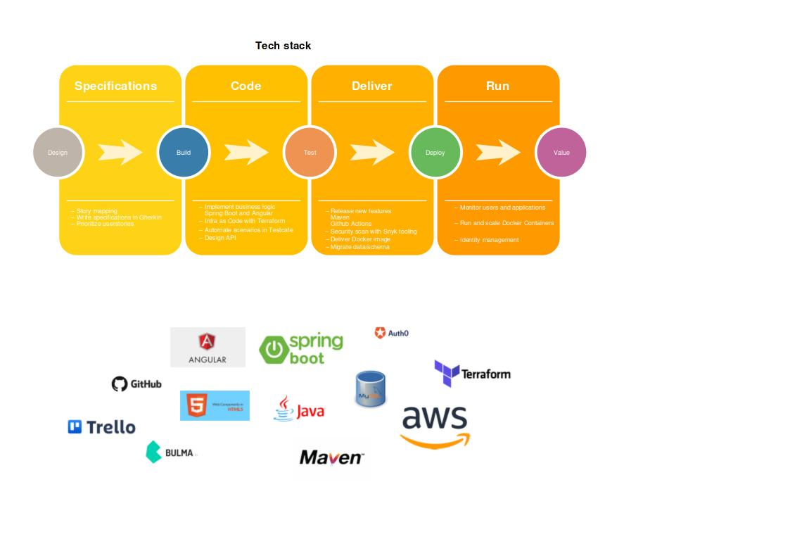

# Backlog

[Trello kanban board](https://trello.com/b/Sk4Tljgm/kanban-board)

# Communication

[Slack channel nl_littil_dev](https://app.slack.com/client/T0DCK75U0/C02TS8QTPM0)

# Trunk 'Main' based development

Trunk based development is just about the easiest git based workflow there is.
Just build and test a feature and commit/push it to the Main branch.

- Try to prevent long-lived feature branches.
- Every developer can push into the main branch.
- Run tests before you push.
- When you commit use the trello story name in the commit message
- What gets pushed can be released, so be aware of this.
- Of course, you can create a feature branch if you prefer. For example to create a PR for a review.

Read more about the pros and cons:

[devops-tech-trunk-based-development](https://cloud.google.com/architecture/devops/devops-tech-trunk-based-development)

# Backend Project

This project is mainly worked on by people familiar with the NL Java User Group.
Therefore, it makes sense to use at least some Java.

The initial tech stack:

- Java 17 (GraalVM)
- Maven build system
- Quarkus
- Delivered as a docker image created by the Spring-native build pack
- Code-style: ...

See Readme in back-end project to get you up and running.

# Frontend Project

Initial tech stack:

- Angular 12
- Delivered as a Nginx docker image
- Spectator for unit-component tests
- Css framework tbd: bulma, material, tailwind, bootstrap, ....
- Code-style: ...

See Readme in front-end project to get you up and running.

# Hosting/Infra

It is necessary not to depend too much on a specific hosting platform, it should be easy to migrate, and it should be easy to run everything locally.
Docker Images run just about anywhere. That's why the deliverables are docker images.

- Terraform
- Dependabot

# CI/CD

- Github actions

# Database

Mysql

# Security