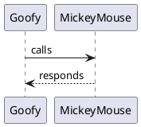

---
hide:
  - navigation
  - toc
---

# Homepage
This is the root of the documentation site of the Littil platform. It supports Markdown and PlantUML. 

For example: 

Will generate:

 

You can also include files using:

~~~{.Dockerfile linenums=1 title="Dockerfile"}

~~~

Or even include files from a git repository:
~~~{.gherkin linenums=1 title="Feature file fetched from a repository"}
{{ gitsnippet('Devoxx4Kids-NPO/littil-e2e', 'src/test/resources/features/teacher_registration.feature') }}
~~~