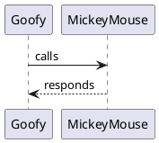

---
hide:
  - navigation
  - toc
---

# Homepage
This is the root of the documentation site of the Littil platform. It supports Markdown and PlantUML. 

For example: 

Will generate:

 

You can also include Gherkin files

~~~{.gherkin linenums=1 title="Teacher account feature"}

~~~