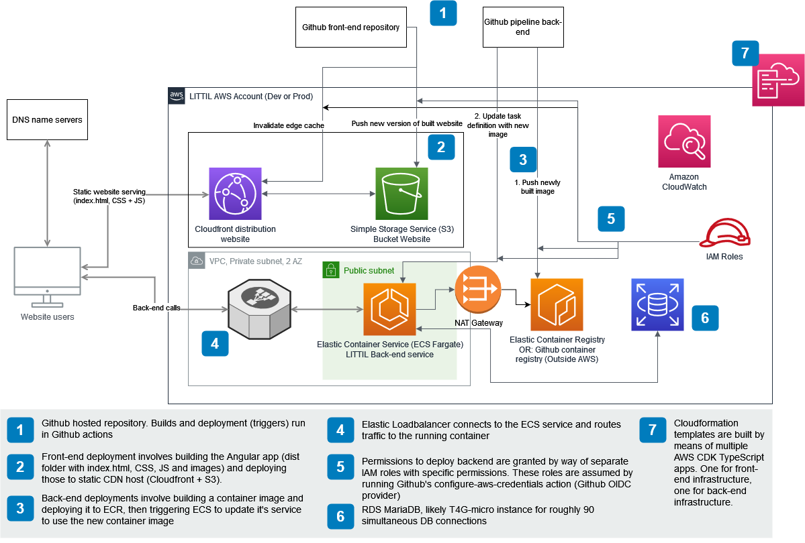

## Getting started with LITTIL infrastructure

### Definition of Done (DoD)

## Infra as code (IaC)

To make sure infrastructure deployments are reliably reproducible across time and environments, LITTIL defines infrastructure as code.
Within the AWS ecosystem that is currently used this effectively means Cloudformation templates (in YAML or JSON) for the foundation, and CDK apps for applications (after the CDK has been bootstrapped in the foundation).

To add infrastructure components, they should be added to a new or existing CDK app or Cloudformation template. When creating resources, determine their appropriate place using the following questions:

Q: Is this infrastructure component part of a specific application (e.g. the back-end service or front-end)

If so, place the component in the CDK app belonging to that application. If this is a new application, create an `infrastructure` folder in this new application's Git repository.

Q: Is this a component that should be rolled out over all environments (staging & production)? Is it for a specific environment? Does it make sense to consider it in the context of an environment?

For example, a database is probably going to be accessed by only one application (the data's owner). So a database can be created in the context of an application (in the CDK app of that application).

On the other side, a domain name is an example of a component that spans environments (supports both staging.littil.org and littil.org), and even has uses or properties that do not correspond to any environment (such as email DNS records). So a domain (as an infrastructure component) should be place in the central infrastructure repository.

Q: Should it be considered an "application" component, or a "foundation" component?

Some components might not be as wide in scope as a domain name, but they might also not correspond to an environment. For example resources related to aggregating logs from all systems (in all AWS accounts, including but not limited to the environments). Code for these infra resources should be in the infrastructure repository.

## Infrastructure code

LITTIL infrastructure is currently made up out of three pieces:
- A cloud foundation: located in the [littil-infrastructure repository](https://github.com/Devoxx4Kids-NPO/littil-infrastructure)
- Back-end infrastructure: located in the [infrastructure folder in the littil-backend repository](https://github.com/Devoxx4Kids-NPO/littil-backend/tree/main/infrastructure)
- Front-end infrastructure: located in the [infrastructure folder in the littil-frontend repository](https://github.com/Devoxx4Kids-NPO/littil-frontend/tree/main/infrastructure)

The cloud foundation consists of procedures and code for bootstrapping AWS CDK and setting up a link with Github pipelines. With this foundation in place, applications can be deployed, as is done from the application specific repositories.

## Cloud architecture

Note: Diagram contains draw.io source (load diagram from this PNG image)

Note: This picture shows the infrastructure as designed (intended). Actual infrastructure may deviate (see TODO note)

TODO: Since the back and front-end are separate applications, deployed separately, this diagram should be split and put with the respective infra code it describes.

AWS Feedback 2022-09-13:
- Use Amplify for front-end. Hosting & Build in AWS in a cost-effective way
  - Pay per build-minute & gigabyte storage & gigabyte traffic
  - Free tier eligible
- ECR (Elastic Container Registry) for image storage
  - Pay for storage, use expiry date on images to save on storage
  - Use ECR vulnerability scanning (setting in ECR, functionality from Security Hub)
- Load balancer for back-end ingress
  - Only way to get traffic dynamically routed. Elastic IP is free of charge, but requires manual DNS updates to internal container IP
- ECS (Elastic Container Service) for back-end runtime
  - ARM or x86, ARM is cheaper (native compilation with Quarkus?)
  - Fargate
- Networking
  - Private subnet, VPC with 2 AZ (Availability Zones)
  - NAT Gateway for egress (to retrieve images from ECR)
- CDK
  - Use aws_ecs_patterns in TypeScript CDK, network details will be abstracted away
- RDS (Relational Database Service) for persistence
  - EC2 instance T4G-micro, 2vCPU, 1GB, good for ~89 DB connections

Decisions on start of implementation front-end infra 2022-09-24
- Use Cloudfront & S3 for front-end. Amplify would use those anyway, and could be useful. But for now it adds unnecessary complexity.
